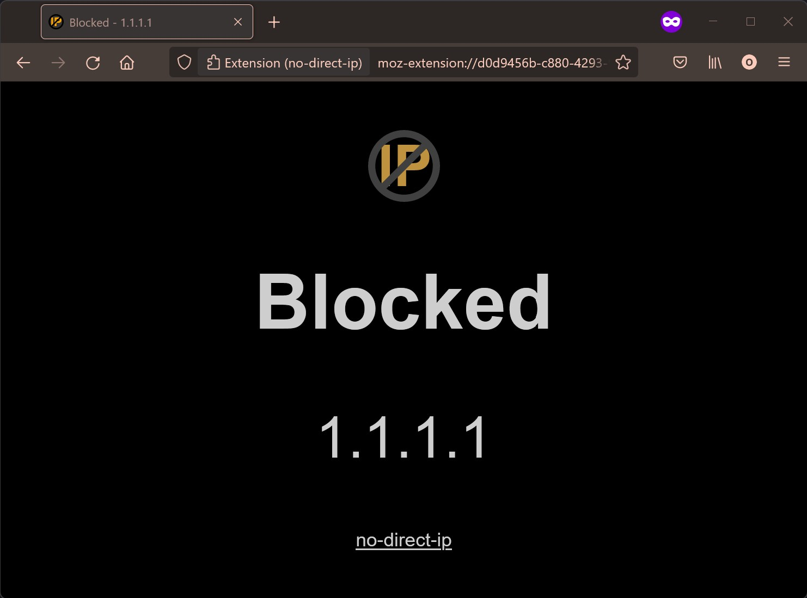

# no-direct-ip

&nbsp;&nbsp;&nbsp;

## What it does

This browser extension blocks external or public IP v4 and v6 addresses.

## Features

Completely local with no external lookups or tracking.

Multi-language support in the _blocked_ page (based of browser's language).

Blocked page follows browser's dark mode.

Blocks both IPv4 and v6 addresses.

Multi-browser support (Edge, Chrome and Firefox tested).

The following IP addresses are allowed:
* 127.0.0.0/8
* 10.0.0.0/8
* 192.168.0.0/16
* 172.16.0.0/12
* 169.254.0.0/16
* ::1/128
* fd00::/8

Raise and upvote features in [Discussions](https://github.com/OllieJC/no-direct-ip/discussions).

## Screenshots

## Version

0.2.5
